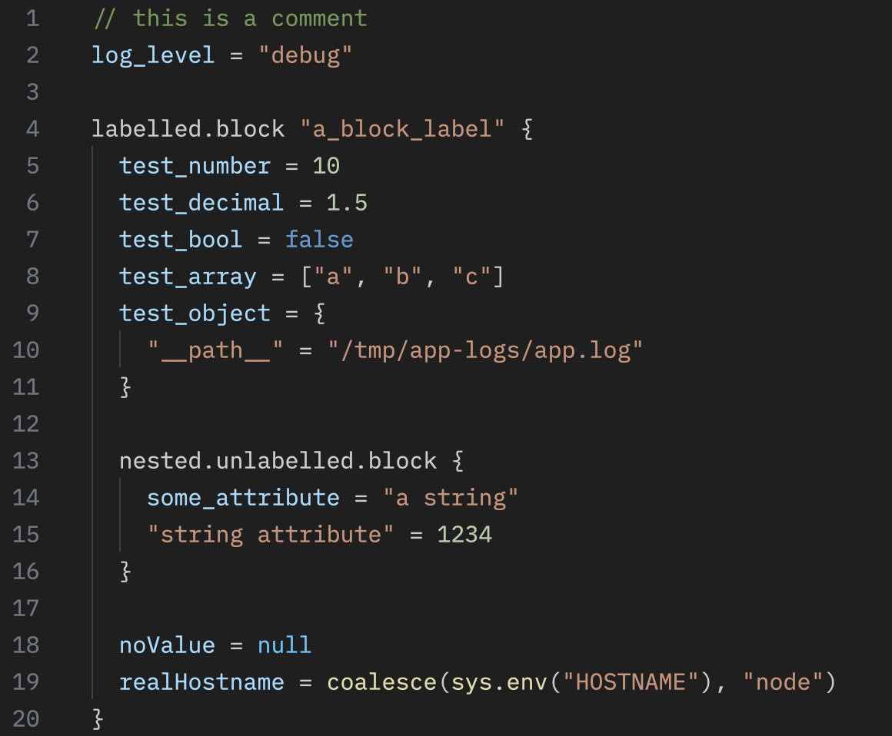

# Zed Alloy

[Grafana Alloy](https://grafana.com/oss/alloy-opentelemetry-collector/) language
and syntax highlighting extension for the [Zed](https://zed.dev/) IDE.

Uses the [Grafana Alloy Tree-sitter grammar](https://github.com/mattsre/tree-sitter-alloy/) 
by [@mattsre](https://github.com/mattsre)

## Screenshot

## Installation

Clone this repository, then use `Install Dev Extension` in Zed and choose the
cloned repository to build and enable the extension.
